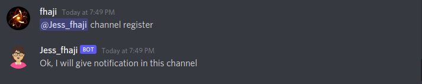
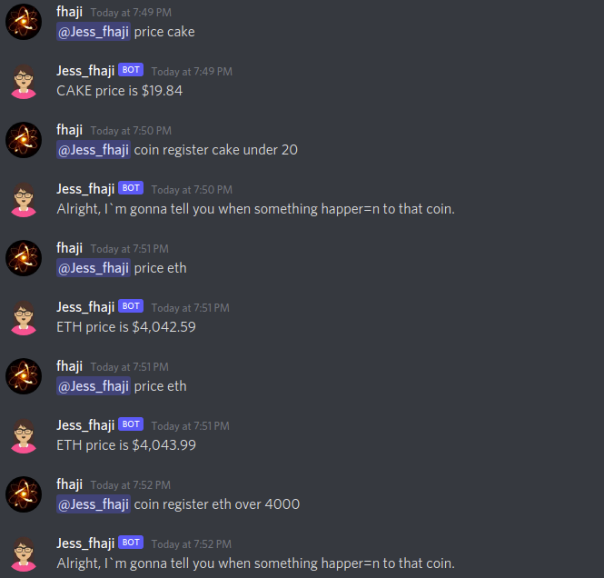
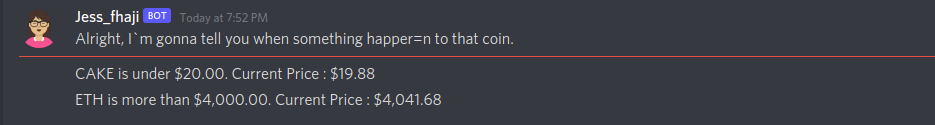
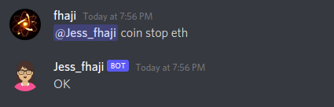

# JESS - Crypto Price Discord Channel Notifier Bot

JESS is a discord bot that I use to notify me on Discord channel in my server when some crypto coin price hit a specific price threshold that I define.

The bot will run in a cron for every 5 minutes and use the data from [livecoinwatch.com](https://www.livecointwatch.com) for comparing current price with threshold price, and if the condition is valid, the bot will blasting a notif message to registered channel.

## Prerequisite

In order to use this bot, you need to get:

- Discord bot token. [[Here]](https://discord.com/developers/applications)
- API Token livecoinwatch.com [[Here]](https://www.livecoinwatch.com/tools/api)

After that, you just need to create ``.env`` file (or rename the ``.env.example``) and fill out the needed token and another needed configuration. The env file should be look like this:

```
CLIENT_TOKEN=DISCORD_BOT_TOKEN
WHITELIST_USERNAME=fhaji #this is discord username user that allowed to execute command
LIVEWATCH_TOKEN=LIVECOINWATCH_API_TOKEN
APP_ENV=production
```

## How to run

### 1. Use Docker

Pull the image

``docker pull fhaji/jess-bot:1``

If you already setup the env needed to a file, you could run the image with:

``docker run --env-file .env fhaji/jess-bot:1``

### 2. Clone Project

After cloning this project, you could just run regular ``npm install``, and then run the migration ``knex migrate`` and just run it by using ``npm run dev``.

But if you have docker compose installed, you could run the project by using entrypoint script:

```./jess up```

## Bot Flow

Keep in mind that currently, the bot will only work in a channel, so you need to invite the bot to your channel first.

In this version, the bot will only understand your command if you mention the bot first follow with the command name.
After the bot successfully running, you could look up the available command by using:

``@bot_username help``

Current flow should be look like this:

- Register the channel for the notification



- Register your coin criteria



- Get Notified



- You could stop the notif if you don't need it anymore

